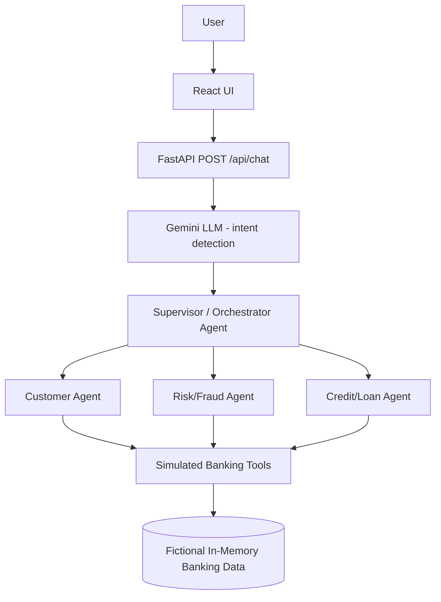

# Multi-Agent Banking MVP

## Project Overview

An educational, simulated banking application that shows how a multi-agent AI architecture can handle natural-language banking requests. It combines:

- **React** frontend (Vite)
- **FastAPI** backend
- **Gemini** LLM for intent detection
- **Supervisor/Orchestrator Agent** that routes each request
- **Customer/Banking Agent**, **Risk/Fraud Agent** and **Credit/Loan Agent**
- **Simulated banking tools** working on **fictional, in-memory data**

## Important Disclaimer

- This project is an **educational simulation**.
- It does **not** connect to real banks.
- It does **not** process real financial transactions.
- All customer, account, transaction and credit data are **fictional**.
- It must **not** be used for real financial decisions.

## Architecture



Flow: the React UI posts the message to `/api/chat`; the backend asks Gemini to classify the intent; the Supervisor selects the specialized agent; the agent calls simulated tools that read the in-memory data; the result is returned to the UI together with the routing trace.

## Agent Responsibilities

**Customer/Banking Agent** (`customer_agent`)
- Customer information
- Account balance
- Recent transactions

**Risk/Fraud Agent** (`risk_agent`)
- Transaction risk analysis
- Risk score and risk level
- Fraud indicators (reasons)

**Credit/Loan Agent** (`credit_agent`)
- Loan eligibility
- EMI calculation

**Supervisor/Orchestrator** (`supervisor_agent`)
- Receives the detected intent
- Selects the appropriate specialized agent
- Passes only the parameters that agent accepts
- Returns the agent result

## Use Cases

| Use case | Intent | Agent | Demo values |
|---|---|---|---|
| Account balance | `balance` | Customer Agent | Account `ACC001` |
| Recent transactions | `transactions` | Customer Agent | Account `ACC001` |
| Suspicious transaction detection | `risk_analysis` | Risk/Fraud Agent | Transaction `TXN1005` |
| Loan eligibility | `loan_eligibility` | Credit/Loan Agent | Customer `CUST001`, loan amount 500000 |
| EMI calculation | `emi` | Credit/Loan Agent | 500000 at 8.5% for 5 years |

The supervisor also supports a `customer_info` intent (customer profile, uses `CUST001`). Requests Gemini cannot classify return an `unknown` intent and an error message.

## Technology Stack

**Backend:** Python, FastAPI, Pydantic, Google GenAI SDK, Gemini Flash Lite (`gemini-flash-lite-latest`)

**Frontend:** React, Vite, JavaScript, CSS

## Project Structure

```
Multi-Agent-Banking-MVP/
├── backend/
│   └── app/
│       ├── main.py            # FastAPI app and endpoints
│       ├── llm.py             # Gemini intent detection
│       ├── banking_data.py    # Fictional in-memory data
│       ├── agents/            # Supervisor, customer, risk and credit agents
│       └── tools/             # Simulated banking, risk and credit tools
├── frontend/                  # React + Vite UI
├── requirements.txt           # Backend dependencies
├── .env.example               # Environment variable template
└── .gitignore
```

## Setup Instructions (Windows)

### Backend

```powershell
git clone <YOUR_GITHUB_REPOSITORY_URL>
cd Multi-Agent-Banking-MVP

python -m venv venv
.\venv\Scripts\Activate.ps1

pip install -r requirements.txt
```

Create a `.env` file in the project root (copy `.env.example`) and set your key:

```
GEMINI_API_KEY=your_actual_key
```

Start the backend:

```powershell
uvicorn backend.app.main:app --reload
```

> **Important:** start the backend from the **project root**, because the code imports modules as `backend.app...`.

- Backend: http://127.0.0.1:8000
- Swagger UI: http://127.0.0.1:8000/docs

### Frontend

In a second terminal:

```powershell
cd frontend
npm install
npm run dev
```

- Frontend: http://localhost:5173

The Vite dev server proxies `/api` and `/health` to the backend on `127.0.0.1:8000`, so the backend must be running.

## API Endpoints

| Method | Path | Purpose |
|---|---|---|
| GET | `/` | Basic status message confirming the app is running |
| GET | `/health` | Health check, returns `{"status": "ok"}` |
| POST | `/api/chat` | Main endpoint: takes a message and optional parameters, runs intent detection, supervisor routing and the specialized agent |

`POST /api/chat` request body:

```json
{
  "message": "Is transaction TXN1005 suspicious?",
  "customer_id": "CUST001",
  "account_id": "ACC001",
  "transaction_id": "TXN1005",
  "loan_amount": 500000,
  "principal": 500000,
  "annual_interest_rate": 8.5,
  "tenure_years": 5
}
```

Only `message` is required. The response contains `user_message`, the detected `intent` (with `confidence`) and `routing` (supervisor, selected agent and agent result).

## Example Natural-Language Prompts

- "What is my account balance?"
- "Show my recent transactions"
- "Is transaction TXN1005 suspicious?"
- "Am I eligible for a loan of 500000?"
- "Calculate EMI for 500000 at 8.5% for 5 years"

Gemini detects the intent of each message; the Supervisor then routes the request to the matching specialized agent. There is no keyword routing in the API layer. The frontend supplies the demo IDs and extracts simple numeric values (amount, rate, years) from the text, falling back to the demo defaults.

## Demo Flow (5–10 minutes)

1. Start the backend and the frontend.
2. Open http://localhost:5173 and show the UI.
3. Run the five use cases, using the suggested prompts or the examples above.
4. For each one, open the **Agent execution trace** panel.
5. Explain the flow: Gemini intent detection → Supervisor → specialized agent → simulated tool.
6. Close by repeating the disclaimer: all data is simulated.

## Testing / Validation

The five main use cases have been validated manually through the API (`POST /api/chat`) and currently return successful responses, each reaching the expected specialized agent. There is **no automated test suite** (e.g. pytest) yet.

## Limitations

- No real bank integration
- No authentication or authorization
- Fictional in-memory data
- No persistent database
- Simplified loan eligibility rules
- Simplified fraud/risk rules
- Depends on the Gemini API (network, key and quota)
- No production security or rate limiting

## Future Improvements

- Authentication and authorization
- Database persistence (e.g. PostgreSQL)
- Real banking API adapters in a controlled environment
- Better fraud detection models
- More advanced credit scoring
- Automated test suite
- Observability and logging
- Rate limiting
- Production deployment

## License

This project is created for educational and portfolio purposes.
