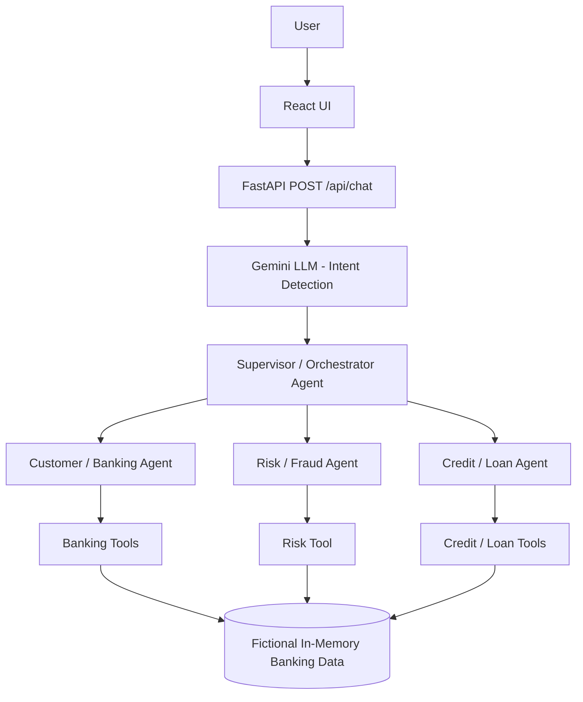

# Multi-Agent Banking MVP

## Project Overview

An educational, simulated banking application that demonstrates how a multi-agent AI architecture can handle natural-language banking requests.

The application combines:

- **React** frontend with Vite
- **FastAPI** backend
- **Gemini LLM** for natural-language intent detection
- **Supervisor/Orchestrator Agent** for intelligent request routing
- **Customer/Banking Agent**
- **Risk/Fraud Agent**
- **Credit/Loan Agent**
- **Simulated banking tools** operating on fictional, in-memory data

The system demonstrates how an LLM can understand different banking-related requests, select the appropriate specialized agent, execute the required simulated tool, and return the result together with an execution trace.

---

## Important Disclaimer

This project is an **educational simulation only**.

- It does **not** connect to real banks.
- It does **not** process real financial transactions.
- All customer, account, transaction, and credit information is **fictional**.
- Loan and fraud decisions are based on simplified demonstration rules.
- The application must **not** be used for real financial decisions.

---

## Architecture



### Request Flow

```text
User
  ↓
React UI
  ↓
FastAPI
  ↓
Gemini Intent Detection
  ↓
Supervisor / Orchestrator
  ↓
Specialized Agent
  ↓
Simulated Banking Tool
  ↓
Fictional Banking Data
  ↓
Result + Agent Execution Trace
  ↓
React UI
```

The React frontend sends the user's natural-language message to the FastAPI backend.

The backend uses Gemini to classify the request into a supported intent. The Supervisor then selects the appropriate specialized agent and passes only the parameters required by that agent.

The specialized agent executes the corresponding simulated banking tool and returns the result to the frontend.

---

## Multi-Agent System

### 1. Customer / Banking Agent

Handles general customer and account-related requests.

Responsibilities:

- Customer information
- Account balance
- Recent transactions

Supported intents:

```text
customer_info
balance
transactions
```

---

### 2. Risk / Fraud Agent

Handles transaction risk analysis.

Responsibilities:

- Suspicious transaction detection
- Risk score calculation
- Risk level classification
- Fraud/risk indicators
- Flagging potentially suspicious transactions

Supported intent:

```text
risk_analysis
```

---

### 3. Credit / Loan Agent

Handles credit and loan-related requests.

Responsibilities:

- Credit profile
- Credit score
- Monthly income and existing debt information
- Loan eligibility
- EMI calculation

Supported intents:

```text
credit_profile
loan_eligibility
emi
```

---

### 4. Supervisor / Orchestrator Agent

The Supervisor coordinates the specialized agents.

Responsibilities:

- Receives the detected intent
- Selects the appropriate specialized agent
- Passes only the required parameters
- Prevents unsupported requests from reaching banking tools
- Returns the selected agent and execution result

Unsupported or unclear requests are routed to an `unknown` intent and safely rejected without executing a specialized banking tool.

---

## Supported Banking Capabilities

| Use Case | Intent | Agent | Demo Values |
|---|---|---|---|
| Account balance | `balance` | Customer Agent | Account `ACC001` |
| Recent transactions | `transactions` | Customer Agent | Account `ACC001` |
| Suspicious transaction detection | `risk_analysis` | Risk/Fraud Agent | Transaction `TXN1005` |
| Credit profile | `credit_profile` | Credit/Loan Agent | Customer `CUST001` |
| Loan eligibility | `loan_eligibility` | Credit/Loan Agent | Customer `CUST001`, ₹5,00,000 |
| EMI calculation | `emi` | Credit/Loan Agent | ₹5,00,000 at 8.5% for 5 years |

---

## Natural-Language Interaction

The application is designed to understand different ways of asking the same banking question.

For example:

```text
"What is my credit score?"
```

and:

```text
"Can you show me my credit profile?"
```

are both classified as:

```text
credit_profile
```

Similarly:

```text
"Can I get a loan of 500000 based on my financial profile?"
```

is classified as:

```text
loan_eligibility
```

And:

```text
"How much would my monthly EMI be for a ₹5 lakh loan at 8.5% interest for 5 years?"
```

is classified as:

```text
emi
```

The system does not depend on a fixed list of exact user questions. Gemini performs intent detection before the Supervisor routes the request.

---

## Safe Handling of Unsupported Requests

The system intentionally avoids hallucinating unsupported banking capabilities.

For example:

```text
"Can you transfer ₹20,000 from my account to another account?"
```

The system returns an `unknown` intent and does not execute a banking tool.

Similarly, unrelated questions such as:

```text
"What is the weather today?"
```

are not routed to any banking agent.

Instead, the system provides a safe response listing the supported banking capabilities.

This demonstrates controlled agent routing and prevents unsupported operations from being presented as available functionality.

---

## Technology Stack

### Backend

- Python
- FastAPI
- Pydantic
- Google GenAI SDK
- Gemini Flash Lite
- Pytest

### Frontend

- React
- Vite
- JavaScript
- CSS

### AI / Agent Architecture

- Gemini-based intent detection
- Supervisor / Orchestrator pattern
- Specialized banking agents
- Tool-based simulated banking operations

---

## Project Structure

```text
Multi-Agent-Banking-MVP/
├── backend/
│   └── app/
│       ├── main.py              # FastAPI app and API endpoints
│       ├── llm.py               # Gemini intent detection
│       ├── banking_data.py      # Fictional in-memory banking data
│       ├── agents/              # Supervisor and specialized agents
│       └── tools/               # Simulated banking, risk and credit tools
│
├── frontend/                    # React + Vite frontend
│
├── tests/                       # Automated backend tests
│
├── requirements.txt             # Backend dependencies
├── .env.example                # Environment variable template
└── .gitignore
```

---

## Setup Instructions

### Prerequisites

- Python 3.10+
- Node.js
- npm
- Gemini API key

### Backend Setup

Clone the repository:

```powershell
git clone https://github.com/gowsi12303/Multi-Agent-Banking-MVP.git
cd Multi-Agent-Banking-MVP
```

Create a Python virtual environment:

```powershell
python -m venv venv
```

Activate the environment:

```powershell
.\venv\Scripts\Activate.ps1
```

Install backend dependencies:

```powershell
pip install -r requirements.txt
```

Create a `.env` file in the project root.

Use `.env.example` as the template:

```text
GEMINI_API_KEY=your_gemini_api_key_here
```

Start the backend from the project root:

```powershell
uvicorn backend.app.main:app --reload
```

Backend:

```text
http://127.0.0.1:8000
```

Swagger UI:

```text
http://127.0.0.1:8000/docs
```

> The backend should be started from the project root because the application imports modules using the `backend.app...` package structure.

### Frontend Setup

Open a second terminal:

```powershell
cd frontend
npm install
npm run dev
```

Frontend:

```text
http://localhost:5173
```

The Vite development server proxies `/api` and `/health` requests to the FastAPI backend.

Therefore, the backend must be running while using the frontend.

---

## API Endpoints

| Method | Endpoint | Purpose |
|---|---|---|
| GET | `/` | Basic application health/status |
| GET | `/health` | Health check |
| POST | `/api/chat` | Main natural-language banking endpoint |

### POST `/api/chat`

Example request:

```json
{
  "message": "Is transaction TXN1005 suspicious?",
  "customer_id": "CUST001",
  "account_id": "ACC001",
  "transaction_id": "TXN1005",
  "loan_amount": 500000,
  "principal": 500000,
  "annual_interest_rate": 8.5,
  "tenure_years": 5
}
```

Only `message` is required.

Optional fields provide the simulated demo context used by the frontend and specialized tools.

The response contains:

- User message
- Detected intent
- Intent confidence
- Supervisor routing
- Selected specialized agent
- Agent status
- Tool result

---

## Example Natural-Language Prompts

### Customer / Banking

```text
What is my account balance?
```

```text
Can you show me my recent transactions?
```

```text
Who am I?
```

### Risk / Fraud

```text
Is transaction TXN1005 suspicious?
```

```text
I noticed a large international transaction. Can you check if it looks suspicious?
```

### Credit Profile

```text
What is my credit score?
```

```text
Can you show me my credit profile?
```

### Loan Eligibility

```text
Am I eligible for a loan of 500000?
```

```text
Can I get a loan of 500000 based on my financial profile?
```

### EMI

```text
Calculate EMI for 500000 at 8.5% for 5 years.
```

```text
How much would my monthly EMI be for a ₹5 lakh loan at 8.5% interest for 5 years?
```

Gemini detects the intent from the natural-language request and the Supervisor routes it to the corresponding specialized agent.

---

## Demo Flow

The recommended demo duration is approximately **5–10 minutes**.

1. Start the FastAPI backend.
2. Start the React frontend.
3. Open the Banking AI interface.
4. Introduce the multi-agent architecture.
5. Demonstrate account balance.
6. Demonstrate recent transactions.
7. Demonstrate suspicious transaction detection.
8. Demonstrate credit profile / credit score.
9. Demonstrate loan eligibility.
10. Demonstrate EMI calculation.
11. Show the **Agent Execution Trace** after each request.
12. Demonstrate an unsupported request such as a money transfer.
13. Demonstrate an unrelated request such as a weather question.
14. Explain that unsupported requests are safely rejected.
15. Close with the educational simulation disclaimer.

### Execution Trace

The UI shows:

```text
Gemini Intent Detection
        ↓
Supervisor Agent
        ↓
Specialized Agent
        ↓
Tool / Result
```

This makes the multi-agent decision flow visible during the demo.

---

## Testing and Validation

The project includes an automated pytest test suite covering:

- Banking tools
- Risk tools
- Credit tools
- Customer Agent
- Risk/Fraud Agent
- Credit/Loan Agent
- Supervisor routing
- LLM intent handling
- API endpoints
- Unknown intent handling

### Backend Test Result

```text
62 passed, 1 warning
```

The warning comes from a third-party `google-genai` dependency and does not represent an application test failure.

### Frontend Validation

Lint:

```powershell
npm run lint
```

Passed successfully.

Production build:

```powershell
npm run build
```

Passed successfully.

### Manual Validation

The following natural-language scenarios were validated through the UI:

- Account balance
- Recent transactions
- Suspicious transaction detection
- Credit score
- Credit profile
- Loan eligibility
- EMI calculation
- Unsupported transfer request
- Unrelated non-banking request

All supported use cases reached the expected specialized agent and returned the expected simulated results.

Unsupported and unrelated requests were safely routed to `unknown` without executing a specialized banking tool.

---

## Limitations

- No real bank integration
- No real financial transactions
- No authentication or authorization
- Fictional in-memory data
- No persistent database
- Simplified loan eligibility rules
- Simplified fraud/risk rules
- Simplified credit profile data
- Depends on Gemini API availability, network access, API key and quota
- No production-grade security
- No rate limiting
- Not suitable for real financial decisions

---

## Future Improvements

Potential future improvements include:

- Authentication and authorization
- Database persistence using PostgreSQL
- Controlled banking API adapters
- More advanced fraud detection models
- More advanced credit scoring
- Improved parameter extraction for complex financial requests
- Observability and structured logging
- Rate limiting
- Production deployment
- Additional banking agents and tools
- More comprehensive end-to-end testing

---

## Educational Purpose

This project was created as a learning and portfolio project to demonstrate:

- Multi-agent AI architecture
- LLM-based intent detection
- Supervisor/orchestrator patterns
- Specialized AI agents
- Tool-based agent execution
- Natural-language interfaces
- API integration
- React and FastAPI development
- Automated testing
- Safe handling of unsupported requests

All banking information in this project is fictional and simulated.

---

## License

This project is created for educational and portfolio purposes.